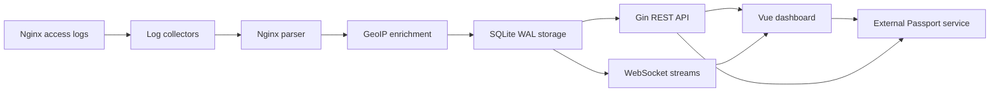

# SvcWatch

SvcWatch is a full-stack Nginx access-log monitoring and analytics platform. It
tails multiple log files in real time, parses each request into structured
records, enriches client IPs with GeoIP data, and exposes secured REST and
WebSocket APIs to a responsive Vue dashboard.

It is designed as a lightweight, self-hosted observability service for personal
servers and small service deployments.

## Highlights

- Real-time log collection with file-following and log-rotation support
- Multiple configurable log sources, each stored in its own SQLite table
- GeoIP enrichment for country, region, city, latitude, and longitude
- Dashboard KPIs with previous-period comparison
- Live request and error statistics over WebSocket
- Historical QPS, error-rate, P99-latency, and bandwidth trends
- HTTP status distribution and top path, IP, and User-Agent rankings
- Detailed log explorer with filters, sorting, and pagination
- External Passport service integration for login, token validation, and
  endpoint-level permission checks
- Swagger API documentation
- GitHub Actions workflows for backend matrix deployment and frontend deployment

## Dashboard

The frontend currently provides the following views:

| View | Purpose |
| --- | --- |
| Overview | Request KPIs, live traffic, status distribution, recent logs, and top paths |
| Trends | Historical QPS, error rate, P99 latency, and bandwidth charts |
| Top Stats | Client IP and User-Agent rankings with latency and error-rate metrics |
| Map | GeoIP-based request distribution on a world map |
| Logs | Filterable, sortable, and paginated structured log explorer |
| Sources | Monitored source tables and ingestion record counts |
| Profile | User profile and avatar management through the Passport service |

The dashboard supports light and dark themes and a collapsible navigation
sidebar.

## Architecture



The backend starts one monitor for every configured target. Each monitor tails
its log file, parses incoming lines, and writes structured entries to the
target's SQLite table. Analytics endpoints can query one source or aggregate
across multiple sources.

## Tech Stack

### Backend

- Go
- Gin
- SQLite with WAL mode
- Gorilla WebSocket
- `nxadm/tail`
- MaxMind GeoLite2 City database
- Swagger / OpenAPI

### Frontend

- Vue 3
- TypeScript
- Vite
- Pinia
- Tailwind CSS
- ECharts
- Axios

### Operations

- GitHub Actions
- Nginx reverse proxy
- Certbot-managed TLS certificates

## Repository Structure

```text
.
|-- backend/
|   |-- cmd/server/             # Backend application entry point
|   |-- config/                 # Environment-specific YAML configuration
|   |-- data/                   # GeoLite2 database
|   |-- docs/                   # Generated Swagger documentation
|   |-- internal/
|   |   |-- api/                # Gin router
|   |   |-- collector/          # Real-time file tailing
|   |   |-- controller/         # REST and WebSocket handlers
|   |   |-- middleware/         # Token and permission validation
|   |   |-- monitor/            # Per-source monitoring pipeline
|   |   |-- parser/             # Nginx log parser
|   |   |-- service/            # Aggregation and business logic
|   |   `-- storage/            # SQLite persistence and analytics queries
|   `-- nginx/                  # Backend Nginx template
|-- frontend/
|   `-- src/
|       |-- layouts/            # Application layout
|       |-- services/           # API client and response types
|       |-- stores/             # Authentication and theme state
|       `-- views/              # Dashboard pages
`-- .github/workflows/          # Backend and frontend deployment workflows
```

## Supported Log Format

SvcWatch parses the standard Nginx combined log format. It also accepts an
optional `$request_time` value at the end of each line:

```text
$remote_addr - $remote_user [$time_local] "$request" $status $body_bytes_sent "$http_referer" "$http_user_agent" $request_time
```

Recommended Nginx configuration:

```nginx
log_format svcwatch '$remote_addr - $remote_user [$time_local] '
                    '"$request" $status $body_bytes_sent '
                    '"$http_referer" "$http_user_agent" $request_time';

access_log /var/log/nginx/access.log svcwatch;
```

Timestamps are normalized to UTC before being stored.

## Getting Started

### Prerequisites

- Go version compatible with `backend/go.mod`
- Node.js `^20.19.0` or `>=22.12.0`
- npm
- An accessible Passport authentication service
- Nginx log files matching the supported format

The repository includes `backend/data/GeoLite2-City.mmdb`. If the database
cannot be loaded, log ingestion continues without geographic enrichment.

### 1. Configure the Backend

Backend configuration is selected using `APP_ENV`:

```text
APP_ENV=development -> backend/config/config.development.yaml
APP_ENV=staging     -> backend/config/config.staging.yaml
APP_ENV=production  -> backend/config/config.production.yaml
```

Development example:

```yaml
server:
  port: 8080
  geoip_db_path: "data/GeoLite2-City.mmdb"

auth:
  passport_url: "http://127.0.0.1:8089/api/v1/auth/check-token"
  permission_url: "http://127.0.0.1:8089/api/v1/auth/check-permission"
  sys_code: "SevWatch"

targets:
  - path: "./access.log"
    table: "nginx_logs"
  - path: "./access_api.log"
    table: "api_logs"

database:
  clear_on_startup: true
```

Add another item under `targets` to monitor another log source. Table names
must be unique and should contain only trusted SQL identifier characters.

> `clear_on_startup: true` drops and recreates configured log tables whenever
> the backend starts. Use `false` when data must persist across restarts.

### 2. Run the Backend

Run commands from the `backend` directory so relative log, database, and GeoIP
paths resolve correctly:

```bash
cd backend
go mod download
APP_ENV=development go run ./cmd/server
```

The development API listens on `http://127.0.0.1:8080`.

Useful endpoints:

- Health check: `http://127.0.0.1:8080/api/v1/sev/ping`
- Swagger UI: `http://127.0.0.1:8080/swagger/index.html`

The SQLite database is created as `backend/nginx_logs.db` when the server is
launched from the backend directory.

### 3. Configure and Run the Frontend

Development proxy targets are configured in `frontend/.env.development`:

```dotenv
VITE_PASSPORT_SERVICE_URL=http://127.0.0.1:8089
VITE_BACKEND_SERVICE_URL=http://127.0.0.1:8080
```

Start the dashboard:

```bash
cd frontend
npm install
npm run dev
```

Vite proxies:

- `/api/passport/*` to the external Passport service
- `/api/sev/*` to the SvcWatch backend

The frontend login page requires valid Passport service credentials before
protected dashboard routes can be opened.

## API Overview

All endpoints except `ping` require a bearer token and a successful permission
check through the configured Passport service.

Base path: `/api/v1/sev`

| Method | Endpoint | Description |
| --- | --- | --- |
| GET | `/ping` | Service health check |
| GET | `/overview` | KPI overview with previous-period comparison |
| GET | `/distribution` | HTTP status-code distribution |
| GET | `/stats` | Total ingested records per configured source |
| GET | `/stats/timeseries` | QPS, error rate, P99 latency, or bandwidth trend |
| GET | `/stats/top-paths` | Most frequently requested paths |
| GET | `/stats/top-ips` | Most active client IPs |
| GET | `/stats/top-user-agents` | Most active User-Agent strings |
| GET | `/stats/geo-distribution` | GeoIP request distribution |
| GET | `/logs` | Detailed logs with filters, sorting, and pagination |
| GET | `/logs/ws` | Live raw log-line stream |
| GET | `/stats/ws` | Live request and error statistics |

Statistics endpoints accept time ranges in RFC3339, `datetime-local`, or
`YYYY-MM-DD HH:mm:ss` format. Validated statistics ranges cannot exceed one
year.

The log explorer supports:

- Source ID or log filename
- Start and end time
- IP prefix
- HTTP method
- Exact status or status class such as `5xx`
- Request path keyword
- Minimum and maximum latency
- Time-descending or latency-descending sorting
- Pagination up to 500 records per page

## Authentication and Permissions

SvcWatch delegates identity and authorization to an external Passport service:

1. The frontend signs in through `/api/passport/auth/login`.
2. The bearer token is attached to SvcWatch API requests.
3. The backend validates the token through `passport_url`.
4. The backend validates the endpoint permission through `permission_url`.

Current backend permissions include:

- `view:overview`
- `view:distribution`
- `view:logs`
- `view:stats`

WebSocket clients may pass the token through the `token` query parameter.

## Development Commands

Backend:

```bash
cd backend
go test ./...
go run ./cmd/server
```

Frontend:

```bash
cd frontend
npm run dev
npm run build
npm run test:unit
npm run lint
```

## Deployment

Both workflows run on pushes to `main` when their relevant files change:

- `.github/workflows/deploy-backend.yml`
- `.github/workflows/deploy-frontend.yml`

### Backend Deployment

The backend workflow builds a Linux AMD64 binary and deploys it in parallel to
the servers listed in the `DEPLOY_TARGETS` repository variable.

Example `DEPLOY_TARGETS` value:

```json
[
  {
    "host": "1.1.1.1",
    "user": "ubuntu",
    "domain": "api.example.com",
    "log_nginx": "/var/log/nginx/access.log",
    "log_api": "/var/log/nginx/access_api.log"
  }
]
```

Required repository secrets:

- `SERVER_SSH_KEY`
- `AUTH_PASSPORT_URL`
- `AUTH_PERMISSION_URL`
- `AUTH_SYS_CODE`

The workflow injects each target's log paths, starts SvcWatch with
`APP_ENV=production`, and can configure an HTTPS Nginx reverse proxy when a
matching Certbot certificate already exists.

### Frontend Deployment

Required repository secrets:

- `SERVER_SSH_KEY`
- `FRONTEND_HOST`
- `FRONTEND_USER`

The frontend workflow builds the Vite application, copies `dist` to the target
server, and configures Nginx for SPA routing, API proxying, WebSocket upgrades,
and HTTPS.

## Storage Notes

- The current persistence layer is SQLite, not Redis.
- WAL mode and a busy timeout are enabled for concurrent reads and writes.
- Each configured source maps to a separate table.
- Analytics queries can combine tables with `UNION ALL`.
- Log timestamps are stored as UTC RFC3339 strings.

## License

This project is licensed under the terms in [LICENSE](LICENSE).
